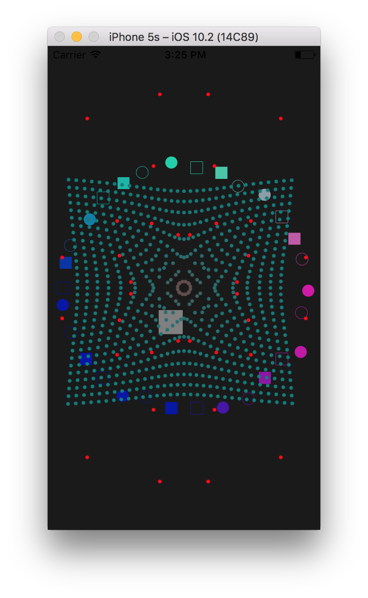

# Swift OpenGL Sample

Simple Xcode projects to demonstrate the following topics: 

* Swift 3 (iOS) + GLKit (ES 3.0+)
* Importing external static library (C++)
* Copying C++ arrays to OpenGL's VBO (Swift)

This example consists of two projects: 

1. External: C++ code that simulates a particle system.
2. App: iOS application that displays 2D animation using results from External. 

## Prerequisites

* macOS 10.12
* Xcode 8.12

## Usage

* Open Swift-OpenGL workspace in Xcode. Run the App project to launch the Simulator. 
* Tap anywhere on the screen to reset the particle animation

## Notes

* For a simpler sample without helper classes, refer to be3ae5e30e08ebc5ad2bf010e526c57dc1852bbb

## Screenshot

